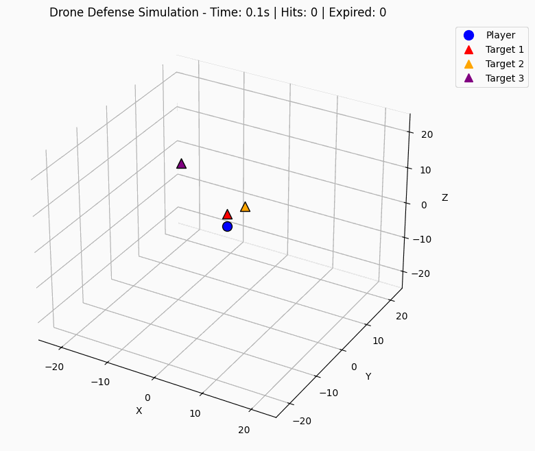
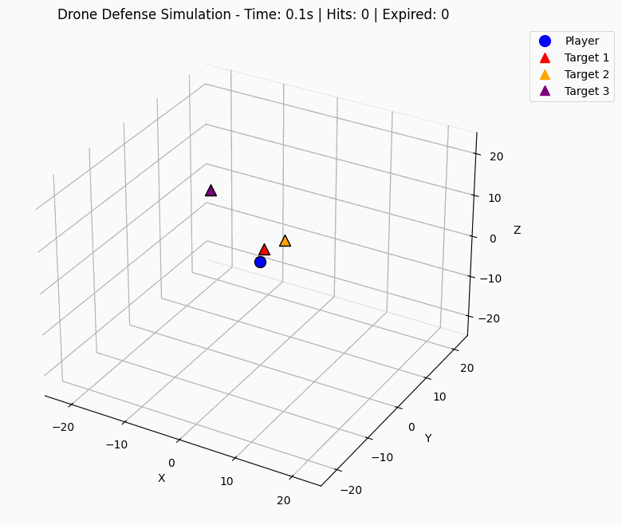

# RL_With_Delayed_Reward

This project investigates reinforcement learning in environments with delayed rewards through a 3D target-catching simulation.  
The experiments demonstrate that traditional delayed reward structures significantly hinder learning performance, while introducing intermediate reward signals and LSTM-enhanced value functions dramatically improves training convergence and agent effectiveness.  
The simulation environment is implemented in Rust for performance optimization with a Python interface for RL training.

## Results

This project investigates reinforcement learning in environments with delayed rewards, specifically training an agent to catch moving targets in a 3D simulation environment.  
For performance reasons, the simulation is implemented in Rust, with a wrapping Python interface.  
The key challenge of the delayed reward setting is that traditional reward signals are only provided when targets are caught or at episode termination, making it difficult for agents to learn effective policies from intermediate actions.

### Experimental Setup

The simulation environment consists of:
- A 3D free-moving player agent that can navigate in all directions
- Multiple enemy targets with predefined velocities or trajectory functions
- Sparse reward structure where rewards are only given upon target capture or episode completion
- Time pressure component where targets may expire if not caught within their flight time

### Key Findings

The findings in this project align with the [RUDDER](https://ml-jku.github.io/rudder/) and [Accelerating Proximal Policy Optimization](https://arxiv.org/abs/2411.17861) papers.

#### 1. Reward Function Design

**Delayed vs. Intermediate Rewards**: The experiments demonstrate that purely delayed reward structures hinder learning performance. Introducing intermediate reward signals showed faster convergence and higher final performance compared to the delayed-only baseline:

- **Baseline (Delayed Only)**: Rewards only at target capture and episode end
- **Enhanced (Intermediate)**: Additional rewards for:
  - Moving towards targets (proximity-based rewards)
  - Time-sensitive target prioritization (urgency bonuses)
  - Progress incentives during episodes when catching targets

| Baseline Agent (Delayed Rewards Only) | Enhanced Agent (Intermediate Rewards) |
|:--------------------------------------:|:--------------------------------------:|
|  |  |
| Agent trained with purely delayed rewards showing slower convergence and suboptimal target prioritization | Agent trained with intermediate urgency bonuses demonstrating improved targeting |


#### 2. Network Architecture Impact

**LSTM Integration in PPO Value Function**: Incorporating Long Short-Term Memory (LSTM) networks into the value function of the Proximal Policy Optimization (PPO) algorithm yielded faster policy convergence and training acceleration:

- **Standard PPO**: Traditional feedforward networks for both policy and value functions
- **LSTM-Enhanced PPO**: LSTM integration specifically in the value function to capture temporal dependencies

| Standard PPO | LSTM-Enhanced PPO |
|:------------:|:-----------------:|
|  |  |
| Traditional feedforward networks for both policy and value functions | LSTM integration in value function showing better temporal understanding and target prioritization |

The LSTM-enhanced approach demonstrated:
- Better handling of temporal relationships in the delayed reward setting
- Improved ability to maintain information about target states and priorities over time


### Summary

The combination of intermediate rewards and LSTM-enhanced value functions outperformed the baseline delayed reward structure resulted in a faster and more stable training convergence.

These results highlight the importance of:
1. **Reward Engineering**: Even in naturally sparse reward environments, carefully designed intermediate signals can dramatically improve learning efficiency
2. **Temporal Understanding**: The ability to maintain and utilize historical information (LSTMs) is crucial to help agents better understand long-term consequences in delayed reward scenarios


## Gettings started

Initialize your environment with [uv](https://docs.astral.sh/uv/):

```
uv venv && uv sync
```


### In case of python linker errors while building rust files:

Try to set the `PYO3_PYTHON` environment variable to the python executable:
```
source .venv/bin/activate
export PYO3_PYTHON=$(which python3)
cargo build
```

## Example Usage

- Generate a scenario with the script in `./scripts/generate_scenario.py` or use the default one in `./configs/drone_env/default_config.yaml`
- Run and render the simulation with the script in `./scripts/example_usage.py`

## Train an agent on the environment

- Train with skrl: `uv run python scripts/train_skrl_ppo.py`
- Train with stable baselines: `uv run python scripts/train_stable_baseline_ppo.py`

Both scripts will save the trained model in the `./skrl` or `./stable_baselines` directory respectively.  
An example episode will be rendered to the `./animations` directory.  
You can skip the training parts of the scripts and go straight to inference by providing a path to a trained model.

Comand line arguments for `train_skrl_ppo.py`:
```
--model-path
            Path to load pre-trained model from. If empty, training will start from scratch.
--experiment-name
            Name of the experiment for logging and model saving
--use-lstm
            Whether to use LSTM for the ppo value function or not
--config-path
            Path to the drone environment configuration YAML file
--training-length
            Maximum number of steps for training episode
--eval-render-interval
            Interval for rendering during evaluation
```

## Contributing
- Install automatic git commit message with `git config --local commit.template .gitmessage`

### Linting

Linting and testing can easily be triggered via the makefile:
- make linting
- make tests

You can also set the following `setting.json` file in the local `.vscode/` directory for automatic code formatting on save:
```
{
    "[python]": {
        "editor.formatOnSave": true,
        "editor.codeActionsOnSave": {
        "source.fixAll": "explicit",
        "source.organizeImports": "explicit"
        },
        "editor.defaultFormatter": "charliermarsh.ruff"
    },
    "ruff.importStrategy": "fromEnvironment",
    "flake8.importStrategy": "fromEnvironment",
    "flake8.path": [
        "pflake8"
    ],
    "editor.formatOnSave": true,
    "workbench.colorCustomizations": {
        "[Your Color Theme]": {
            "editorRuler.foreground": "#ff0000"
        }
    },
    "editor.rulers": [
        100
    ]
}
```